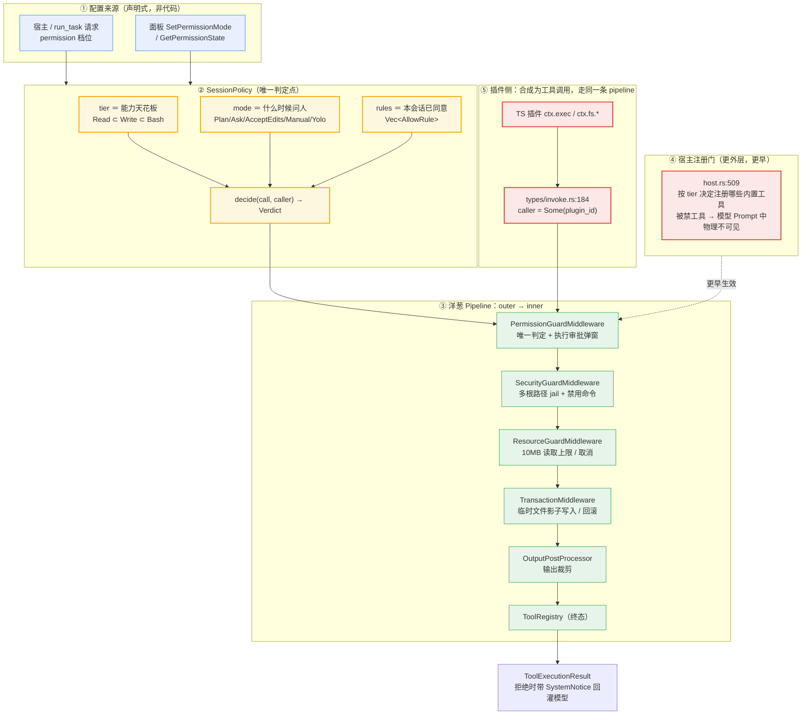
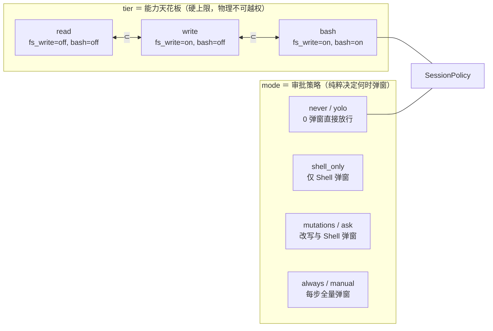
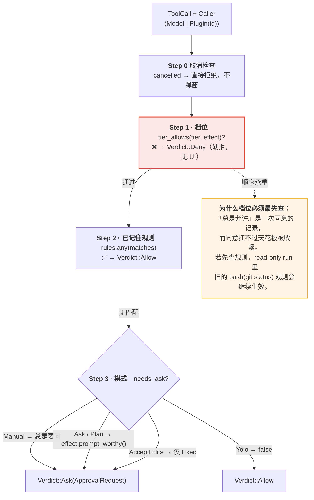
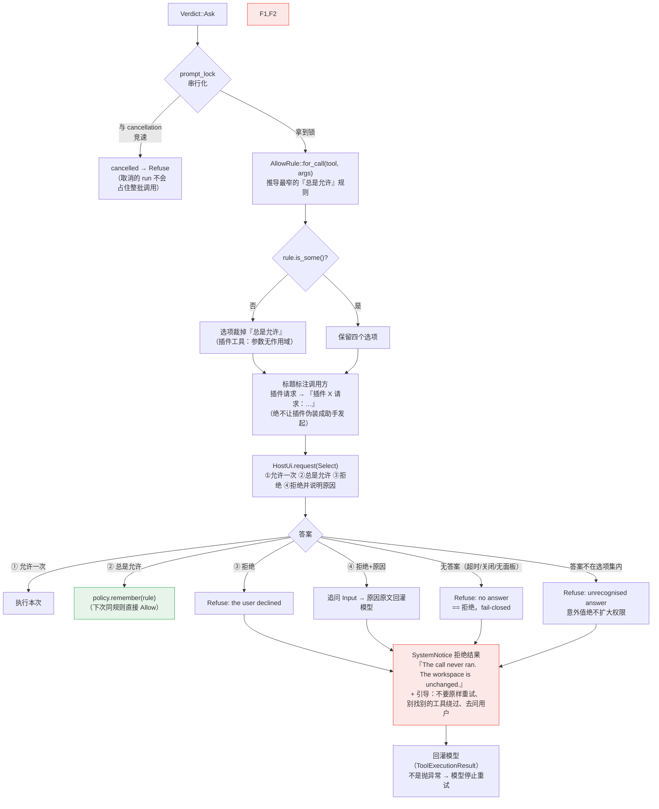
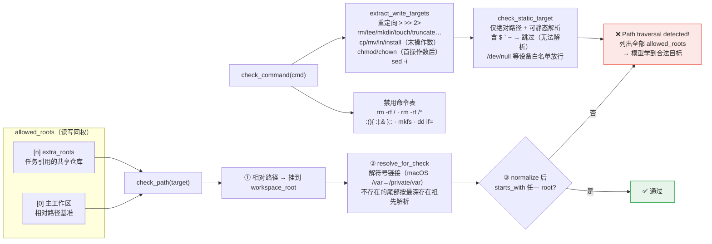
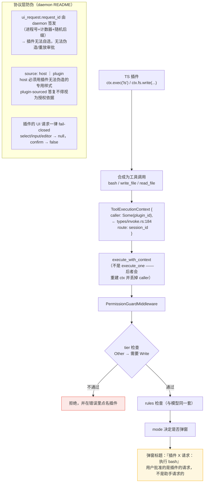

# thunder 权限结构图

> 源码事实图。所有结论都对应到具体文件与函数。
> 唯一判定入口：`SessionPolicy::decide`（`thunder-agent-loop/src/types/policy.rs:484`）

---

## 0. 一句话总览

```
                  ┌──────────────────────────────────────────────┐
                  │  SessionPolicy  ← 权限的唯一"大脑"            │
                  │  { tier, role_tier, mode, rules }            │
                  │  decide() → Allow | Deny | Ask               │
                  └──────────────────────────────────────────────┘
                                    ▲
             判定的三个输入来自：档位 / 模式 / 已记住的规则
```

---

## 1. 全景图：五层防线



---

## 2. 正交的两根轴：tier（档位）× mode（审批模式）

这是整套权限设计的核心。**tier 决定"什么根本不可能"（能力天花板），mode 决定"什么时候向人类确认"（审批策略）**。两轴完全独立，绝不反向耦合。



### 2.1 模式 × 效果 决策矩阵

`ToolEffect::of(tool)` 按工具名分类（`policy.rs`）：

| ToolEffect | 匹配工具 | required_tier | prompt_worthy |
|---|---|---|---|
| `Read` | `read_file` `grep` `find` `ls` `list_dir` `read` `glob` | `Read` | ❌ |
| `Write` | `write_file` `edit` `write` `apply_patch` `notebook_edit` | `Write` | ✅ |
| `Exec` | `bash` `shell` `powershell` 以及名称含 `exec/terminal/cmd` 的工具 | `Bash` | ✅ |
| `Other` | **其他一切（普通插件 / MCP 工具）** | `Write` | ✅ |

`decide()` 的输出矩阵（纯净正交，无任何死状态）：

| tier ＼ mode | never (yolo) | shell_only | mutations (ask) | always (manual) |
|---|---|---|---|---|
| **read** | 读 Allow<br>写/执行 Deny | 读 Allow<br>写/执行 Deny | 读 Allow<br>写/执行 Deny | 读 Ask<br>写/执行 Deny |
| **write** | 读写 Allow<br>执行 Deny | 读写 Allow<br>执行 Deny | 读 Allow / 写 Ask<br>执行 Deny | 读写 Ask<br>执行 Deny |
| **bash** | 读写执行 Allow | 读写 Allow<br>执行 Ask | 读 Allow<br>写执行 Ask | 全 Ask |

> 提示：在只读角色（`Permission::Read`）下，由于写和执行均已在第一步物理硬拒绝，前端自动锁定为 `never`（免审放行），彻底消除了“只读却问人”的冗余状态。

---

## 3. decide() 的判定顺序 —— 这就是安全属性本身



---

## 4. 审批弹窗：fail-closed 的交互闭环



### 4.1 『总是允许』规则的窄化

`AllowRule::for_call`（`policy.rs:255`）—— 规则绝不授予"一个工具类"：

| 工具类型 | 规则形式 | 匹配逻辑 |
|---|---|---|
| `Exec`（bash） | 命令**到第一个链接符为止**的前缀 | `strip_prefix(prefix)` 后余下部分**不得含** `; & \| \` > < \n $` |
| 路径类（write_file / read_file） | `path` 参数（文件或其下整个目录） | `path == prefix \|\| path.starts_with(prefix + "/")` |
| 其他 | `None` → **不提供**该选项 | — |

> `git status` 永远不会授权 `git status && rm -rf /`。
> `SHELL_CHAINING = [';','&','|','`','>','<','\n','$']`

**审批绑定**：`call_hash(tool, args)` 把批准绑定到具体 `(tool, 参数)`，参数一变即失效，无法重放到别的调用上。

---

## 5. tier 之外的空间权限：多根路径 jail

tier 管"能不能写"，jail 管"能写哪"。后者由 `SecurityGuardMiddleware` 独立执行（`middleware/security.rs`）。



---

## 6. 插件权限：与模型完全同一条路径



> 代价：插件的写入现在也走事务层（产生 `.arp/tmp` 影子文件、保留原文件权限）——比之前手写版本更严格，与模型的 `write_file` 行为一致。

---

## 7. 类结构总览

```mermaid
classDiagram
    class SessionPolicy {
        +Mutex~SessionInner~ inner
        +new(tier, mode) Arc
        +decide(call, caller) Verdict  «唯一判定»
        +set_mode(mode)  «下次调用即生效»
        +set_tier(tier)  «被 mode 裁剪»
        +remember(rule)
        +clear_rules()
        +rules() Vec
        +tier() Permission
        +mode() PermissionMode
    }

    class SessionInner {
        -tier        «有效天花板：mode.effective(role_tier)»
        -role_tier   «宿主设定的原始档位»
        -mode
        -rules
    }

    class Permission {
        <<enumeration>>
        Read
        Write
        Bash
        +allows_read() true
        +allows_write() Write|Bash
        +allows_exec() Bash
        +allows_builtin(name)  «未知名 → true，由其它层管»
        +min()  «Read ⊂ Write ⊂ Bash»
    }

    class PermissionMode {
        <<enumeration>>
        Plan        «ceiling = Read，唯一压低档位»
        Ask
        AcceptEdits
        Manual
        Yolo        «default，不提问»
        +ceiling() Option~Permission~
        +effective(tier) Permission
        +next() / parse() / ALL
    }

    class ToolEffect {
        <<enumeration>>
        Read
        Write
        Exec
        Other  «= Write，fail-safe»
        +of(tool_name)
        +required_tier()
        +is_prompt_worthy()
    }

    class Verdict {
        <<enumeration>>
        Allow
        Deny { reason }
        Ask(ApprovalRequest)
    }

    class AllowRule {
        +tool
        +arg_prefix Option~String~
        +for_call(tool, args)
        +matches(tool, args) bool
    }

    class ApprovalRequest {
        +tool
        +title
        +detail
        +options
        +call_hash
        +caller Caller
    }

    class Caller {
        <<enumeration>>
        Model
        Plugin(String)
    }

    class PermissionGuardMiddleware {
        +NAME
        -policy Arc~SessionPolicy~
        -ui Arc~dyn HostUi~
        -prompt_lock Mutex  «弹窗串行化»
        -timeout Duration
        -workspace_roots
        -tier_hint TierHint
        +new(policy, ui)
        +new_tier_only(tier, roots)
        +with_workspace_roots()
        +with_timeout()
    }

    class SecurityGuardMiddleware {
        -workspace_root
        -allowed_roots
        -forbidden_commands
        +check_path(target)
        +check_command(cmd)
        +with_extra_roots()
    }

    SessionPolicy *-- SessionInner
    SessionPolicy ..> Verdict : decide 返回
    SessionPolicy ..> AllowRule : 记住
    Verdict ..> ApprovalRequest : Ask 携带
    ApprovalRequest *-- Caller
    PermissionMode ..> Permission : ceiling/effective
    ToolEffect ..> Permission : required_tier
    PermissionGuardMiddleware --> SessionPolicy : 询问
    PermissionGuardMiddleware --> ApprovalRequest : 弹窗
    PermissionGuardMiddleware --> SecurityGuardMiddleware : onion 内层
```

---

## 8. 关键设计不变量（都有测试钉住）

| # | 不变量 | 实现位置 | 测试 |
|---|---|---|---|
| 1 | `decide()` 是**唯一**判定入口，其它层只照做 | `policy.rs` 模块文档 | `permission_layer_test.rs` |
| 2 | 判定顺序：tier → rules → mode | `policy.rs:484` | `permission_mode_test.rs`（"nothing above ever produces a tier the run did not grant"） |
| 3 | mode 永不抬升 tier；`{"permission":"read","mode":"yolo"}` 仍只读 | `PermissionMode::ceiling()` | `tool_tier_test.rs`、`permission_mode_test.rs` |
| 4 | 档位被拒的调用**走不到弹窗**（用户无法批准绕过档位） | Pipeline 中 Guard 最外层 | `permission_layer_test.rs` |
| 5 | 被拒的调用**不创建临时文件**（拒绝在事务层之外） | Guard 在 Transaction 外层 | `permission_layer_test.rs` |
| 6 | 审批 fail-closed：无 UI / 超时 / 关闭 / 取消 → 拒绝 | `PermissionGuardMiddleware::prompt` | `policy.rs` 单测 |
| 7 | `yolo` 不问，但 tier 仍生效 | `needs_ask` 分支 | `policy.rs` 单测："yolo must not lift the tier for a plugin" |
| 8 | 未知工具按 `Write` 对待（需 `Write` 而非 `Bash`） | `ToolEffect::of` / `required_tier` | `policy.rs` 单测 |
| 9 | 模式切换后恢复原档位（保留 `role_tier`） | `SessionPolicy::set_mode` | `permission_mode_test.rs` |
| 10 | 弹窗串行，避免并发批叠框批准错对象 | `prompt_lock` | 契约点 5 |
| 11 | 拒绝回灌为工具结果 + `SystemNotice`，非异常 | `PermissionGuardMiddleware::refuse` | — |
| 12 | extra_roots 与主工作区**读写同权** | `with_extra_roots` | `multi_root_jail_test.rs` |

---

## 9. 三个值得注意的边界

### 9.1 默认 `yolo` 是刻意的产品决策
`policy.rs:73-95` 写得很直白：审批门 fail-closed，无面板宿主上每个弹窗都判为"取消＝拒绝"。若默认 `ask`，升级后所有无面板用户的**每一次写文件、每一条 shell、每一个插件工具**都会被静默拒绝——"一个没人要求的安全特性，在第一天就把产品搞坏，结果只会被整个关掉"。所以审批是 **opt-in**。

### 9.2 TUI 目前不接审批面板
`thunder-agent-core/tui/src/app.rs:2413-2416` 硬编码 `mode: Some(PermissionMode::Yolo)`、`ui: None`，注释说明：有面板的话 gate 只能拒绝（安全但无用），所以交互式路径交给 daemon。**后果**：TUI 里的 `/permission` 只能压档位，无法开启审批。

### 9.3 角色层已移除
`roles.jsonl` / `RoleRegistry` / `RoleSpec`、面板角色编辑器与 `list_roles` / `set_role` RPC 均已删除：daemon 固定以 `Permission::Bash` + `ApprovalMode::Never` 运行，由模型按意图（Ask / Plan / Write-Edit）自行约束。`SessionPolicy` 的档位 / 模式 / 规则机制仍保留，供宿主（如 TUI `/permission`）显式使用。
